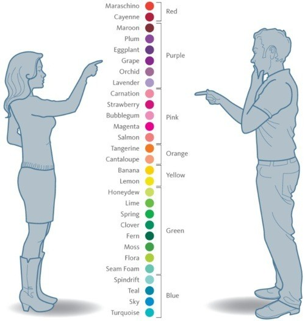

# CSS

Cascading Style Sheets (CSS) is a style sheet language used for describing the look and formatting of a document written in a markup language.

## Fonts

1. Download the font from [Clear Sans Bold](http://www.fontsquirrel.com/fonts/clear-sans), put to `fonts` folder
2. Setup `font-family`
3. Setup Font color, size

```
@font-face {
  font-family: "Clear Sans";
  src: url("/fonts/ClearSans-Bold.ttf");
}

body {
  font-family: "Clear Sans";
  color: #776e65;
}

.cell {
  font-size: 3em;
}
```

## Colors

- Font Color
- Background Color

```
body {
  background: #faf8ef;
  color: #776e65;
}

.board {
  background: #bbada0;
}

.cell {
  background: rgba(238, 228, 218, 0.35);
}
```

## Block Elements

- Width
- Height
- Alignment

```
body {
  text-align: center;
}

.board {
  width: 456px;
  height: 456px;
}

.cell {
  float: left;
  width: 100px;
  height: 100px;
}
```

## Borders

- Border
- Margin
- Padding

```
.board {
  border-radius: 5px;
  margin: 0 auto;
  padding: 8px;
}

.cell {
  border-radius: 3px;
  margin: 7px;
}

.cell > div {
  margin-top: 14px;
}

```

## Cascading behaviour

- Styles are inherited
- Styles are added up together
- CSS Selectors are used to set styles
- Final Styles are computed based on multiple sections of CSS code

## Bootstrap

Bootstrap is the HTML, CSS, and JS framework for developing responsive, mobile first projects on the web.

## Resources

- [CSS in Wikipedia](http://en.wikipedia.org/wiki/Cascading_Style_Sheets)
- [Compare Frameworks](http://usablica.github.io/front-end-frameworks/compare.html)
- [Color Blender](http://meyerweb.com/eric/tools/color-blend/)

## Images

- [Color Survey Results](http://blog.xkcd.com/2010/05/03/color-survey-results/)

