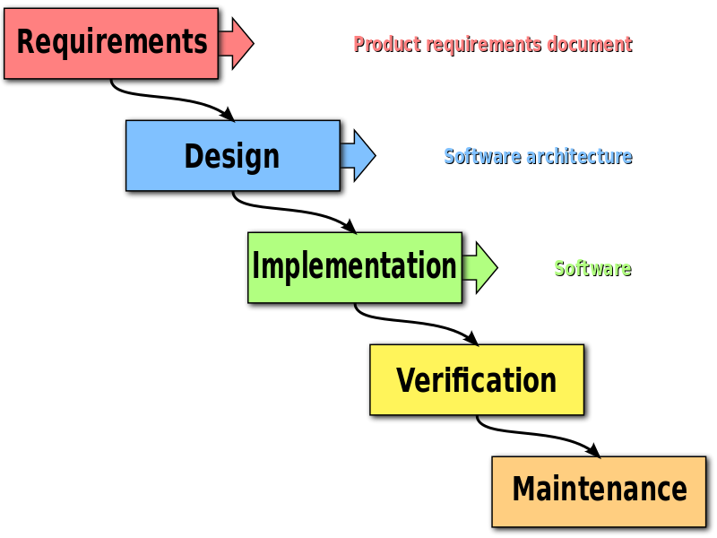

# XP and SCRUM

Briefly explain the eXtreme Programming model and SCRUM using the images below. Encourage the students to read up about development methods online.

## Definition

According to Wikipedia:

> The waterfall model is a sequential design process, often used in software development processes, in which progress is seen as flowing steadily downwards (like a waterfall) through the phases of Conception, Initiation, Analysis, Design, Construction, Testing, Production/Implementation, and Maintenance.

> Big Design Up Front (BDUF) is a concept from Agile Software Development, where non-Agile software development approaches demand the design of a release to be completed and perfected before writing source code. It is often associated with the waterfall model of software development.

The waterfall model (or some variant of BDUF) is best used for projects that are relatively stable and where customer needs can be clearly identified at an early stage.

## Successful completion

The student should have a working understanding of the basic waterfall/BDUF model and when it might be appropriate to use.

## Resources

* [Waterfall model](http://en.wikipedia.org/wiki/Waterfall_model)
* [Big design up front](http://en.wikipedia.org/wiki/Big_Design_Up_Front)

## Images

### The waterfall model

