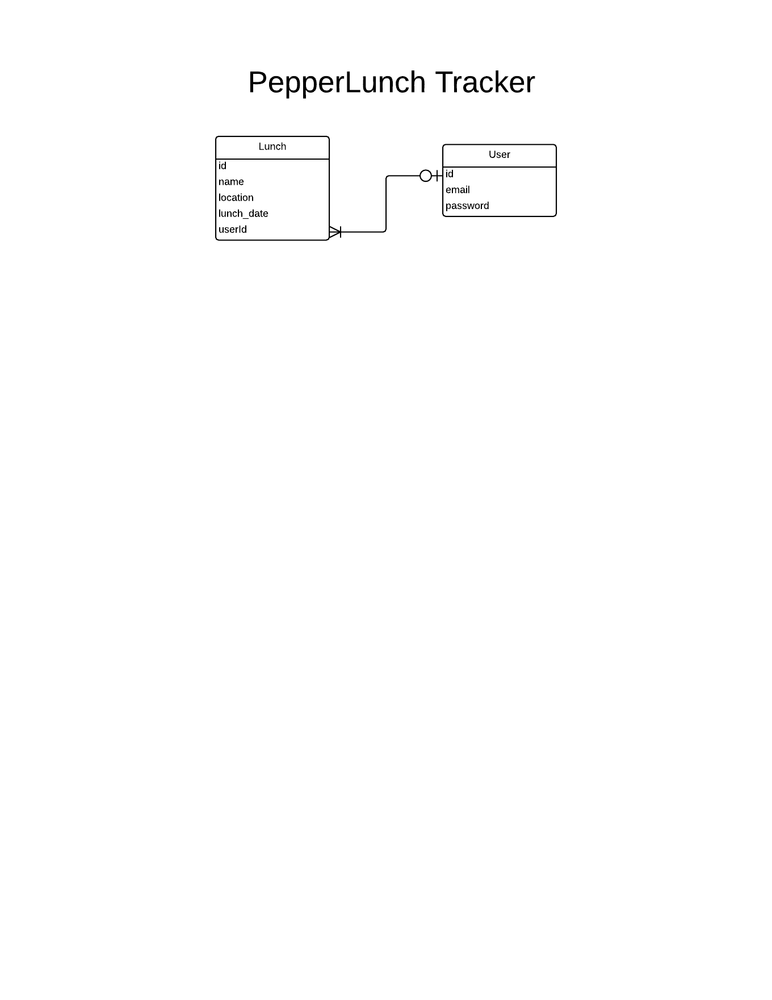

# Building API in Rails

Web API is commonly used in web development, an API is typically defined as a set of Hypertext Transfer Protocol (HTTP) request messages, along with a definition of structure of response messages, usually as XML, or JSON format. Sometimes, the response would be CSV, TSV or other formats as well.

## Objective

A lot of time we may need to build a system for various platforms, the data between different systems cannot be interchanged directly. Thus, we need to build Application Programming Interface (API) to exchange data.

## Steps

1. In the current application, use scaffold to create a resource
2. Consider the resource that we will need, ie. `Lunch` and `User`
3. Scaffold the `Lunch` resource using `rails g scaffold Lunch name:string location:string lunch_date:date`
4. Run `rake db:migrate`
5. We will create the Devise User later on
6. Visit `http://localhost:3000/lunches.json` on the browser

### Ajax Revisit

- Asynchronous JavaScript + XML
- a group of technologies used on the Client side to create asynchronous web applications
- Ideal for creating single page apps
- jQuery, AngularJS and other frontend framework will provide ways to use Ajax

```jQuery
response = $.ajax(
  "http://www.omdbapi.com/?s=Matrix"
).done (data, textStatus, jqXHR) ->
  console.log textStatus
```

### JSON

- JavaScript Object Notation
- Array using `[ ]`
- Object using `{ }`
- Value using `String`, `Number`, `Boolean`, etc.
- Can be nested

```JSON
{
  staffs: [
    {
        id: 1,
        name: 'Harry',
        salary_rate: 'poor'
    },
    {
        id: 2,
        name: 'Harry the Clone',
        salary_rate: 'moderate'
    }
  ]
}
```

### JSON API

- Show the resources using `GET` method
- Post new resource using `POST` method
- Consumes API using clients, like browsers, IoT devices, Postman or terminal.

To do it in Postman,

1. Install `Postman` as Chrome Extenision
2. Open `Postman` through New browser tab, and click `Apps` if you are using Momentum
3. Launch `Postman`
4. Put the URL at the top, select the HTTP method next to it
5. Click `Send` to send the HTTP request
6. For form parameters, you can put key-value pairs or raw data
7. In a POST request to the JSON API, we will provide raw JSON data

### API in Action

1) Scope the API by adding `/api` to the url, in `routes.rb`

```
  scope :api do
    resources :lunches
  end
```

2) Restrict access to limited actions in `routes.rb`

```
  resources :lunches, only: [:index, :create, :show]
```

3) Rescue from Record Not Found in `application_controlle.rb`

```
  rescue_from ActiveRecord::RecordNotFound do
    respond_to do |type|
      type.all  { render :nothing => true, :status => 404 }
    end
  end
```

### jbuilder

- We use `jbuilder` to render the JSON response
- `jbuilder` is written in Ruby
- Other options include `rabl` or create it manually

```jbuilder
json.array!(@lunches) do |lunch|
  json.extract! lunch, :id, :name, :location, :lunch_date
  json.url lunch_url(lunch, format: :json)
end
```

## Chrome Extensions

- [JSONView](https://chrome.google.com/webstore/detail/jsonview/chklaanhfefbnpoihckbnefhakgolnmc?hl=zh-TW)
- [Postman](https://chrome.google.com/webstore/detail/postman-rest-client/fdmmgilgnpjigdojojpjoooidkmcomcm)

## Successful Completion

- Scaffold the `Lunch` resource
- Install the Chrome extensions
- View Lunches as JSON format
- Post Lunch using API

## Images



## Reference Links

- [JSON](http://www.json.org/)
- [JSON API](http://jsonapi.org/)
- [HATEOAS](http://en.wikipedia.org/wiki/HATEOAS)
- [HATEOAS in action (PayPal)](https://developer.paypal.com/docs/integration/direct/paypal-rest-payment-hateoas-links/)
- [API Versioning for Rails Routes](http://stackoverflow.com/questions/9627546/api-versioning-for-rails-routes)
- [jbuilder](https://github.com/rails/jbuilder)
